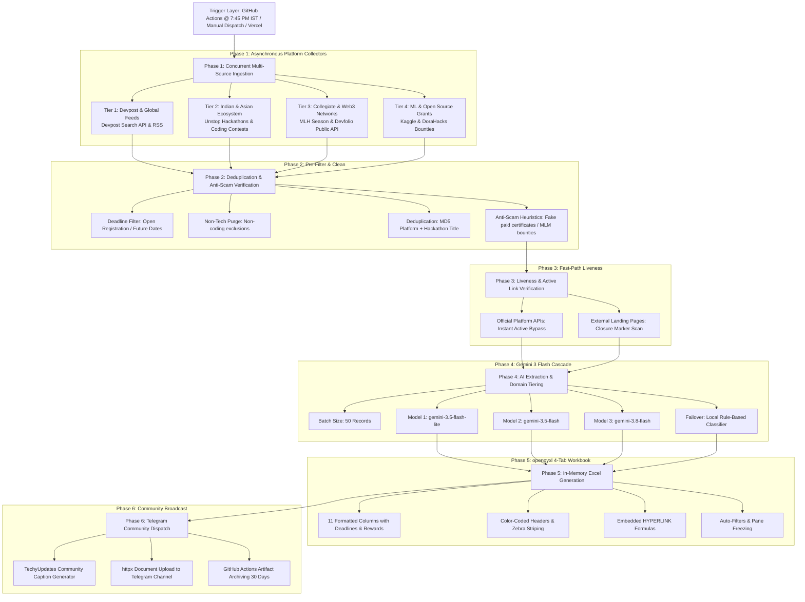

# Product Requirements Document (PRD)
## Autonomous Global Hackathons & Competitions Radar
**Project Name:** `techyupdates-hackathons-engine` (TechyUpdates Hackathon Radar)  
**Version:** 2.1 (Production)  
**Primary Execution:** GitHub Actions (Automated Daily Cron @ 7:45 PM IST / 14:15 UTC & Manual Trigger)  
**Secondary Execution:** Vercel Serverless Function (`api/trigger.py` / `api/health.py`)

---

## 1. Executive Summary & Vision
The **TechyUpdates Hackathons Engine** is an autonomous, serverless-capable data pipeline that scours the global tech and student ecosystem daily for verified, high-reward hackathons, coding competitions, open-source grants, and corporate hiring challenges. It processes over 1,500 raw opportunities across major platforms (Devpost, Unstop, Devfolio, MLH, Kaggle, DoraHacks, and HackerEarth).

The system leverages **Google Gemini 3 AI** to normalize, enrich, and categorize opportunities across four distinct domains, builds a styled 4-tab Excel workbook (`.xlsx`) with clickable registration links, deadline dates, and prize pool breakdowns entirely in-memory, and broadcasts the curated bundle directly to the TechyUpdates Telegram community channel accompanied by an engaging community executive briefing.

---

## 2. End-to-End Pipeline Architecture



---

## 3. Step-by-Step Functional Specifications

### Step 1: Ingestion & Scraping (`services/collectors/`)
The ingestion engine executes 4 parallel asynchronous workers using `httpx.AsyncClient` with an 8.0s timeout per request with zero headless browser overhead.

1. **Tier 1: Devpost & Global Hackathons (`devpost.py`):**
   * Scrapes upcoming and open online/in-person hackathons from Devpost public APIs.
   * Focuses on AI/LLM challenges, developer tools, global prize competitions.
2. **Tier 2: Indian & Asian Premier Challenges (`unstop.py`):**
   * Ingests major hackathons, hiring sprints, and coding challenges from Unstop (IITs, NITs, BITS, Flipkart GRiD, Tata Crucible, Amazon, Microsoft campus challenges).
3. **Tier 3: Collegiate & Web3 Ecosystem (`mlh_devfolio.py`):**
   * **MLH Official Season:** Global collegiate hackathons, beginner-friendly student hackathons.
   * **Devfolio API:** Premier Indian & international hackathons (ETHIndia, HackThisFall, university hackathons).
4. **Tier 4: ML & Open Source Grants (`kaggle_dorahacks.py`):**
   * **Kaggle Competitions:** High-reward machine learning, data science, and Kaggle Grandmaster challenges.
   * **DoraHacks:** Global Web3, public goods, and developer bounty grants.

---

### Step 2: Normalization, Deduplication & Anti-Scam Filter (`services/collectors/`)
Raw hackathons undergo filtering layers before reaching the AI model:
1. **Registration Active Filter:** Only events with future registration deadlines or active submission windows are retained.
2. **Deduplication Hash:** Generates an MD5 signature:
   $$\text{Hash} = \text{MD5}(\text{platform.lower()} + \text{title.lower()})$$
3. **Anti-Scam & Quality Filter:** Purges fake paid challenges, spam MLM token contests, or dubious fee-charging certificate schemes.

---

### Step 3: Liveness & Active Status Verification (`liveness_verifier.py`)
* **Platform Fast-Path:** Verified API feeds bypass redundant HTTP roundtrips.
* **External Link Inspection:** Checks landing pages for closure markers like `"registration closed"`, `"submissions ended"`, `"event concluded"`.

---

### Step 4: AI Extraction & Categorization (`services/ai_extractor.py`)
Events are partitioned into batches of **50 items** and processed through Google Gemini:

1. **Gemini 3 Production Model Hierarchy:**
   $$\text{gemini-3.5-flash-lite} \longrightarrow \text{gemini-3.5-flash} \longrightarrow \text{gemini-3.8-flash}$$
2. **Pacing & Rate Limiting:** 3.0s sleep delay between calls.
3. **Failover:** Automatic fallback to `fallback_classify_hackathon` if AI quotas are exhausted.
4. **Pydantic Data Contract (`HackathonRecord`):**
   * `platform`: Host platform or organizer (e.g. `Devpost`, `Unstop`, `Devfolio`, `MLH`, `Google`, `Solana`).
   * `title`: Standardized hackathon title.
   * `category`: One of:
     * `AI & GenAI Hackathons`
     * `Web3 & Open Source Hackathons`
     * `Student & University Hackathons`
     * `Open Innovation & Hiring Challenges`
   * `theme`: Specific track/theme (e.g. `Agentic AI`, `DeFi & Infra`, `Sustainability`, `Competitive Coding`).
   * `mode`: `Online / Virtual`, `In-Person`, or `Hybrid`.
   * `location`: Geographic location or `Global (Online)`.
   * `prize_pool`: Extracted rewards (e.g. `$50,000`, `₹15,00,000`, `Swag & Mentorship`, `Grants`).
   * `registration_deadline`: Formatted deadline (e.g. `15 Oct 2026`).
   * `event_dates`: Scheduled run dates (e.g. `20-22 Oct 2026`).
   * `eligibility`: Target demographic (e.g. `Students & Grads`, `All Developers`, `Open to All`).
   * `why_participate`: 1-sentence value hook highlighting prizes, networking, or interview fast-tracks.
   * `apply_url`: Direct registration link.

---

### Step 5: In-Memory Excel Workbook Generation (`services/excel_builder.py`)
Using `openpyxl`, builds a 4-tab styled spreadsheet in-memory (`io.BytesIO`).

#### 4 Categorized Tabs & Color Hierarchy:
| Sheet Tab Name | Target Category | Primary Header Theme | Zebra Fill Hex |
|:---|:---|:---:|:---:|
| **🤖 AI & GenAI Hackathons** | Generative AI, LLMs, Agents, Vision, ML, Data Science | Electric Indigo (`#4338CA`) | `#EEF2FF` |
| **🌐 Web3 & Open Source** | Crypto, DeFi, DoraHacks Grants, Public Goods, Tooling | Deep Teal (`#0F766E`) | `#F0FDFA` |
| **🎓 Student & University** | MLH Season, Devfolio College Hacks, Beginner-friendly | Emerald Forest (`#065F46`) | `#F0FDF4` |
| **🏆 Open Innovation & Hiring** | Corporate Sprints, Unstop Challenges, Cash Tournaments | Deep Wine Red (`#991B1B`) | `#FEF2F2` |

#### The 11 Output Columns:
1. `Organizer / Platform` (Left aligned, Width: 20)
2. `Hackathon Title` (Left aligned, Width: 32)
3. `Theme / Track` (Centered, Width: 26)
4. `Mode` (Centered, Width: 16)
5. `Location` (Centered, Width: 22)
6. `Prize Pool / Rewards` (Centered, Width: 22)
7. `Registration Deadline` (Centered, Width: 18)
8. `Event Dates` (Centered, Width: 18)
9. `Eligibility` (Centered, Width: 20)
10. `Why Participate?` (Left aligned, Width: 46)
11. `Direct Apply Link` (Centered, `=HYPERLINK(url, "Register Direct ↗")`, Blue underlined bold font)

#### Spreadsheet UX Features:
* **Frozen Panes:** Top row locked (`ws.freeze_panes = "A2"`).
* **Auto-Filter:** Enabled across all columns.
* **Zebra Striping:** Alternating soft colored fills.

---

### Step 6: TechyUpdates Community Broadcast (`services/telegram_notifier.py`)
The generated `.xlsx` workbook is dispatched to Telegram with a humanized TechyUpdates community caption:

```markdown
🚀 *Hey Tech Fam! Here is your daily TechyUpdates Hackathons & Competitions Radar!* 🏆

📅 *Date:* 25 Sep 2026
✨ We verified *340+ active hackathons, coding contests & innovation challenges* with massive prize pools and fast-track hiring!

🎯 *What's inside today's drop:*
  🤖 *AI & GenAI Hackathons:* 85
  🌐 *Web3 & Open Source Grants:* 64
  🎓 *Student & University Hackathons:* 112
  🏆 *Open Innovation & Hiring Sprints:* 82

🔥 *Today's Top Featured Challenges:*
• 🤖 *Google AI Challenge* — Build Autonomous LLM Agents ($100,000 Prize Pool)
• 🎓 *ETHIndia 2026* — Asia's Premier Web3 Hackathon (Bengaluru • In-Person)
• 🏆 *Flipkart GRiD 7.0* — National Engineering Challenge (Prizes + PPI Offers)
• 🌐 *DoraHacks Global Grant* — Open Source Developer Tooling Bounties

📂 *Attached Excel file:* 4 categorized tabs with 1-click registration links & deadline alerts.
💡 *Pro-tip:* Form your squad early and register before deadlines close! Best of luck building! 🌟
```

---

## 4. Execution & Deployment Infrastructure

### GitHub Actions (Production Execution Engine)
* **Configuration:** [`.github/workflows/daily_pipeline.yml`](file:///d:/TechyUpdates/hackathons_finder/.github/workflows/daily_pipeline.yml)
* **Schedule:** Automated daily trigger at **7:45 PM IST (14:15 UTC)** via cron `'15 14 * * *'`.
* **Manual Execution:** Supported via `workflow_dispatch`.
* **Artifact Retention:** 30 days retention for daily `.xlsx` spreadsheets.

### Secrets Configuration Matrix

| Environment Variable | Required | Storage Location | Description |
| :--- | :---: | :--- | :--- |
| `GEMINI_API_KEY` | **Yes** | Repository Secrets | Google AI Studio API key |
| `TELEGRAM_BOT_TOKEN` | **Yes** | Repository Secrets | Telegram Bot API token from `@BotFather` |
| `TELEGRAM_COMMUNITY_CHANNEL_ID` | **Yes** | Repository Secrets | Target channel username (e.g. `@techy_jobs_updates` or `@techy_hackathons_updates`) |
| `GEMINI_MODEL` | Optional | Repository Secrets | Default: `gemini-3.5-flash-lite` |
| `CRON_SECRET` | Optional | Repository Secrets | For Vercel HTTP authorization |